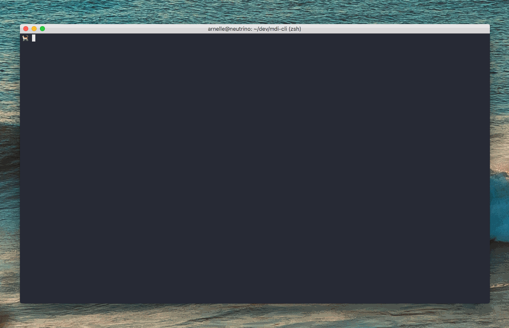

# mdi-cli

Generate material design icons from the command line.

All icons are based on the [@mdi/svg][1] package, which is what [materialdesignicons.com][2] uses.

## Installation

`mdi-cli` can be installed using `npm` by running:

```bash
$ npm install -g mdi-cli
```


## Usage

Installing this package globally will give you the `mdi` command. Take a look at this GIF of how to use this command:




## Why did I build this?

[materialdesignicons.com][2] is cool, I like using it because

1. I can see what the actual icons look like
2. I can easily resize and set padding of the icon and see the results

However, I usually get several icons with the same styles at the same time, and doing so always takes so much time.

This tool allows:

1. Generating multiple icons with the same style
2. Generating icons even when you're offline

However, this also comes with its own downsides:

1. No icon preview while generating, so you kinda have to know the names of the icons that you need


## License

MIT License


[1]: https://github.com/Templarian/MaterialDesign-SVG
[2]: https://materialdesignicons.com/
